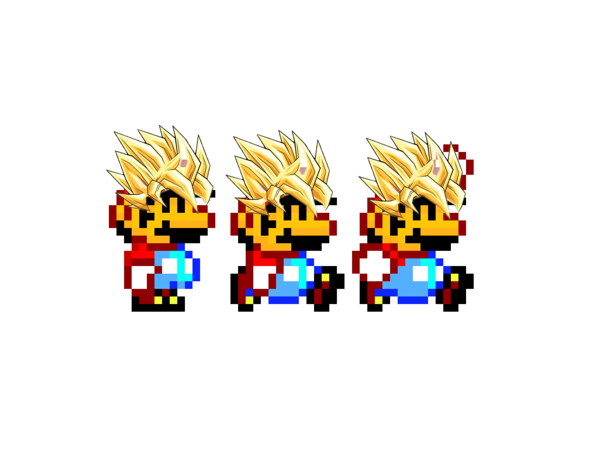

# Super Mario Saiyans
A classic 2D sidescroller with a twist. Navigate Mario through an oncoming stream of enemy Goombas. If you are skilled enough to collect all 7 Dragon Balls, Mario will turn Super Saiyan!

# How to Play
Navigate Mario through the game using the left, right, and up arrow keys.<br> 
Left and right arrow keys will move Mario horizontally.<br>
Up arrow key allows Mario to jump.<br>
In order to kill enemy Goombas, jump and land directly on their heads.<br>
In order for Mario to go Super Saiyan, collect all 7 Dragon Balls. Keep in mind, once Mario is holding 7 Dragon Balls, catching another will restart the count.

# Instillation Instructions
In order to play, click the link below:
Play Game - https://connorga.github.io/Super-Mario-Knockoff/

# Wireframe 
.jpg)
.jpg)


# Technologies
1. HTML5
2. CSS
3. JavaScript

# HTML
```
```
HTML Corresponding to Home Screen
```
<!DOCTYPE html>
<html lang="en">
<head>
    <meta charset="UTF-8">
    <meta http-equiv="X-UA-Compatible" content="IE=edge">
    <meta name="viewport" content="width=device-width, initial-scale=1.0">
    <title>Super Mario Saiyans</title>
    <link href="https://fonts.googleapis.com/css2?family=Press+Start+2P&display=swap" rel="stylesheet">
    <link rel="stylesheet" href="homePageStyle.css">
</head>
<body>
    <div id ="startScreen">
            <h1><span id="blue">S</span><span id="yellow">U</span><span id="red">P</span><span id ="green">E</span><span id="yellow">R</span> <span id="red">M</span><span id="green">A</span><span id="yellow">R</span><span id="blue">I</span><span id="green">O</span><br>  <span id="saiyan">SAIYANS</span></h1>
        <div class = "Objective">
            <h3>Objective</h3>
                <p class = "text">The Goombas are coming!<br>
                    Navigate Mario through a constant stream of oncoming Goombas.<br>
                    Jump on an enemy Goomba's head to earn points and take them out.<br>
                    Be careful though, a head on collision will result in GAME OVER. <br>
                    If you are skilled enough to catch the falling Dragon Balls, great power awaits. <br>
                    Collect all 7 Dragon Balls and Mario will go Super Saiyan!
                </p>
        </div>
        <div class = "controls">
            <h3>Controls</h3>
                <p class = "text">Move Mario horizontally with left and right arrow keys.<br> 
                                Jump by pressing up arrow.<br>
                                When holding all 7 Dragon Balls Mario will have invincibility!
                </p>
        </div>
        <div class = "link">
        <a href="canvas.html">Lets Play</a>
        </div>

        
        
        
    </div>
</body>
</html>

```

```
```
HTML Handling Canvas
```
<!DOCTYPE html>
<html lang="en">
<head>
    <meta charset="UTF-8">
    <meta http-equiv="X-UA-Compatible" content="IE=edge">
    <meta name="viewport" content="width=device-width, initial-scale=1.0">
  
    <title>Super Mario Saiyans</title>
    <link rel="stylesheet" href="canvasStyle.css">
</head>
<body>
    
    <div class = "game">
        <canvas id="canvas1"></canvas>
        
        
        
        
        
        
    </div>
    <script src="app.js">


    </script>
</body>
</html>

```

# CSS
```
CSS styleSheet for Home Page
```
```
body {
    
    text-align: center;
    background-image: url(./Super_Mario_Clouds.gif);
    background-size: cover;
}

h1 {
    font-family: 'Press Start 2P', cursive;
    font-size: 70px;
}
     
#blue {
    color: rgb(26, 175, 229);
}

#yellow {
    color: rgb(255, 208, 0);
}

#red {
    color: rgb(207, 19, 19);
}

#green {
    color: rgb(19, 167, 19);
}

#saiyan {
    color: rgb(243, 115, 10);
}

h3 {
    font-family: Georgia, 'Times New Roman', Times, serif;
    font-size: 40px;
    color: rgb(100, 47, 47);
}

.text {
    font-size: 25px;
    color: rgb(8, 10, 24);

}

.link {
    font-size: 30px;
    margin-top: 80px;
}
```
```
CSS styleSheet for Canvas
```
```
body {
    background: black;
}

   
   
#canvas1 {
    position: absolute;
    top: 50%;
    left: 50%;
    transform: translate(-50%, -50%);
    border: 5px solid white;
}

#playerImage, #backgroundImage, #enemyImage {     
    display: none;                                 
}
```


# JavaScript
```
JavaScript Code Block
```

window.addEventListener('load', function start(){                   //waits for assets to load  before running code
    const canvas = document.getElementById('canvas1');              
    const ctx = canvas.getContext('2d');                            
    canvas.width = 1400;
    canvas.height = 720;                                            
    let enemies = [];                                                
    let score = 0;                                                  
    let dragonBallCounter = 0;
    let gameOver = false;                                           
    let dragonBalls = [];
    
   
    class InputHandler {                                            //InputHandler class will apply eventListeners to keyboard events and hold array of all currently active keys
        constructor(){
            this.keys = [];                                         
            window.addEventListener('keydown', e => {               
                // console.log(e.key);                              
                if ((   e.key === 'ArrowDown' ||                    
                        e.key === 'ArrowUp' ||
                        e.key === 'ArrowLeft' ||                    
                        e.key === 'ArrowRight')
                
                    && this.keys.indexOf(e.key) === -1){            
                    this.keys.push(e.key);                          
                }
            });

            window.addEventListener('keyup', e => {                 
                // console.log(e.key);
                if (    e.key === 'ArrowDown' || 
                        e.key === 'ArrowUp' ||
                        e.key === 'ArrowLeft' ||
                        e.key === 'ArrowRight'){
                    this.keys.splice(this.keys.indexOf(e.key), 1); 
                }                                                    
            });
        }
    }

    class Player {                                                  //Player class will define properties of player object. It will draw it, animate it, and update its position based on user input
        constructor(gameWidth, gameHeight){                         
            this.gameWidth = gameWidth;                             
            this.gameHeight = gameHeight;
            this.width = 170;                                       
            this.height = 300;
            this.x = 0;                                             
            this.y = this.gameHeight - this.height;                 
            this.image = document.getElementById('playerImage');    
            this.frameX = 0;
            this.frameY = 0;                                        
            this.maxFrame = 1.2;
            this.fps = 20;                                          
            this.frameTimer = 0;                                     
            this.frameInterval = 1000/this.fps;                     
            this.speed = 0;                                         
            this.vy = 0;                                            
            this.weight = 1;                                        

        }
        draw(context){                                                                            
            context.strokeStyle = 'transparent'
            context.strokeRect(this.x, this.y, this.width, this.height);
            context.beginPath();
            context.arc(this.x + this.width/2, this.y + this.height/2, this.width/2, 0, Math.PI * 2);  
            context.stroke();
            context.fillStyle = 'transparent';                                                          
            context.fillRect(this.x, this.y, this.width, this.height);                            
            context.drawImage(this.image, this.frameX * this.width, this.frameY * this.height,     
                this.width, this.height, this.x, this.y, this.width, this.height);                 
        }
        update(input, deltaTime, enemies, dragonBalls){                                                                            
            //collision detection for enemies
            enemies.forEach(enemy => {                                                            
                const dx = enemy.x - this.x;                                                      
                const dy = enemy.y - this.y;                                                      
                const distance = Math.sqrt(dx * dx + dy * dy);                                   
                if (distance < enemy.width/2 + this.width/2 && this.vy > 0) {                    
                    enemy.markedForDeletion = true;                        
                    score++;
                    
                } else if(distance < enemy.width/2 + this.width/2 && this.vy === 0){
                    gameOver = true;
                }
                //superSaiyan invincibility 
                 if (dragonBallCounter > 1 && dragonBallCounter % 7 === 0 && distance < enemy.width/2 + this.width/2){
                    enemy.markedForDeletion = true;
                    gameOver = false;
                    score++;
                    
                   
                }
            });
            //collision detection for dragonBalls
            dragonBalls.forEach(ball => {                                                            
                const dx2 = ball.x - this.x;                                                      
                const dy2 = ball.y - this.y;                                                      
                const distance2 = Math.sqrt(dx2 * dx2 + dy2 * dy2);                                   
                if (distance2 < ball.width/2 + this.width/2) {                    
                    ball.markedForDeletion = true;                        
                    dragonBallCounter++;  
                } 
            });
            
            //Sprite Animation
            if (this.frameTimer > this.frameInterval){                                           
                if (this.frameX >= this.maxFrame) this.frameX = 0.275;                           
                else this.frameX = 1.2;
                this.frameTimer = 0;                                                             
            } else {
                this.frameTimer += deltaTime                                                     
            }
            //CONTROLS
            if (input.keys.indexOf('ArrowRight') > -1) {                                          
                this.speed = 8;
            } else if (input.keys.indexOf('ArrowLeft') > -1) {
                this.speed = -8;
            } else if (input.keys.indexOf('ArrowUp') > -1 && this.onGround()) {                   
                this.vy -= 28;
            } else {
                this.speed = 0;                                                                  
            }
            // horizontal movement 
            this.x += this.speed;                                                                  
            if (this.x < 0) this.x = 0;                                                         
            else if (this.x > this.gameWidth - this.width) this.x = this.gameWidth - this.width  
            //vertical movement
            this.y += this.vy;                                                                  
            if (!this.onGround()){                                                              
                this.vy += this.weight;                                                         
                this.frameY = 0;
                this.frameX = 2.2;                                                            
            } else {
                this.vy = 0;                                                                    
                // this.frameY = 0;
                // this.frameX = 0.2;                                                           
            }
            if (this.y > this.gameHeight - this.height) this.y = this.gameHeight - this.height  
       
       
            //superSaiyan movement
            if (dragonBallCounter > 1 && dragonBallCounter % 7 === 0) {
                
                if (input.keys.indexOf('ArrowRight') > -1) {                                          
                    this.speed = 20;
                } else if (input.keys.indexOf('ArrowLeft') > -1) {
                    this.speed = -20;
                } else if (input.keys.indexOf('ArrowUp') > -1 && this.onGround()) {                  
                    this.vy -= 30;
                } else {
                    this.speed = 0;                                                                 
                }
                // horizontal movement 
                this.x += this.speed;                                                                  
                if (this.x < 0) this.x = 0;                                                         
                else if (this.x > this.gameWidth - this.width) this.x = this.gameWidth - this.width 
                //vertical movement
                this.y += this.vy;                                                                  
                if (!this.onGround()){                                                              
                    this.vy += this.weight;                                                         
                    this.frameY = 0;
                    this.frameX = 2.2;                                                            
                } else {
                    this.vy = 0;                                                                    
                    // this.frameY = 0;
                    // this.frameX = 0.2;                                                           
                }
                if (this.y > this.gameHeight - this.height) this.y = this.gameHeight - this.height  
           

            }
        }
        onGround(){
            return this.y >= this.gameHeight - this.height;                                     
        }
    }


    class Background {                                                                                          //Background class will handle endleslly scrolling background. Using a two endleslly scrolling layers 
        constructor(gameWidth, gameHeight) {                                                                    
            this.gameWidth = gameWidth;                                                                         
            this.gameHeight = gameHeight;
            this.image = document.getElementById('backgroundImage');                                            
            this.x = 0;
            this.y = 0;
            this.width = 1500;                                                                                  
            this.height = 815;
            this.speed = 6;                                                                                    
        }
        draw(context){                                                                                          
            context.drawImage(this.image, this.x, this.y, this.width, this. height);                            
            context.drawImage(this.image, this.x + this.width - this.speed, this.y, this.width, this. height);  
        }
        update(){
            this.x -= this.speed;                                                                               
            if(this.x < 0 - this.width) this.x = 0;                                                             
        }
    }

    

    class Powerup {                                         //will handle dragonBalls
        constructor(gameWidth, gameHeight){
            this.gameWidth = gameWidth;
            this.gameHeight = gameHeight;
            this.width = 60;
            this.height = 60;
            // this.image = document.getElementById("dragonBall")
            this.x = this.gameWidth - 600;                               
            this.y = this.gameHeight - this.gameHeight;           
            this.frameX = 1;
            this.vy = 0;
            this.weight = 1;                                   
            this.markedForDeletion = false;
        }
        draw(context){                                                                           
            context.strokeStyle = 'transparent'
            context.strokeRect(this.x, this.y, this.width, this.height);
            context.beginPath();
            context.arc(this.x + this.width/2, this.y + this.height/2, this.width/2, 0, Math.PI * 2);
            context.stroke();
            context.fillStyle = "orange"
            context.fillRect(this.x, this.y, this.width, this.height);
            // context.drawImage(this.image, this.frameX * this.width, 1, this.width, this.height, this.x,     
            // this.y, this.width, this.height); 
        }
        update(){
            this.y += this.vy;                                                                  
            if (!this.onGround()){                                                              
                this.vy += this.weight;
            } else {
                this.vy = 0;
            }
            if (this.y > this.gameHeight - this.height) this.y = this.gameHeight + 100;  
       
       
            this.y += this.vy;                                                                  
            if (!this.onGround()){                                                              
                this.vy += this.weight;
            }                                     
           

        }
    
        onGround(){
            return this.y >= this.gameHeight - this.height;                                     
        }
    }

    function handleDragonBalls(deltaTime) {                                                  //function is responsible for adding, animating, and removing power ups from the game
        if (ballTimer > ballInterval + randomBallInterval){                           
            dragonBalls.push(new Powerup(canvas.width, canvas.height));                        
            console.log(dragonBalls);
            randomBallInterval = Math.random() * 10000 + 500;
            ballTimer = 0;                                                              
        }else {
            ballTimer += deltaTime;                                                     
        }
        dragonBalls.forEach(ball => {                                                      
            ball.draw(ctx);
            ball.update(deltaTime);                                                    
        });
        dragonBalls = dragonBalls.filter(ball => !ball.markedForDeletion)
    }
    
   
    class Enemy {                                                                //Enemy class will generate enemy object
        constructor(gameWidth, gameHeight){                                      
            this.gameWidth = gameWidth;                                          
            this.gameHeight = gameHeight; 
            this.width = 160;                                                    
            this.height = 226;
            this.image = document.getElementById('enemyImage');                  
            this.x = this.gameWidth;                                              
            this.y = this.gameHeight - this.height;                              
            this.frameX = .75;                                                   
            this.maxFrame = 2.05;                                                 
            this.fps = 20;                                                       
            this.frameTimer = 0;                                                  
            this.frameInterval = 1000/this.fps;                                  
            this.frameY = 0;
            this.speed = 8;
            this.markedForDeletion = false;
        }
        draw(context){                                                                            
            context.strokeStyle = 'transparent'
            context.strokeRect(this.x, this.y, this.width, this.height);
            context.beginPath();
            context.arc(this.x + this.width/2, this.y + this.height/2, this.width/2, 0, Math.PI * 2);
            context.stroke();
            context.drawImage(this.image, this.frameX * this.width, 0, this.width, this.height, this.x,     
            this.y, this.width, this.height);                                                     
        }
        update(deltaTime){                                                                       
            if (this.frameTimer > this.frameInterval){                                          
                if (this.frameX >= this.maxFrame) this.frameX = .75;                             
                else this.frameX = 2.05;
                this.frameTimer = 0;                                                            
            } else {
                this.frameTimer += deltaTime;                                                   
            }
            this.x -= this.speed;                                                
           

        }
    }

    
    function handleEnemies(deltaTime) {                                                  //function is responsible for adding, animating, and removing enemies from the game
        if (enemyTimer > enemyInterval + randomEnemyInterval){                           
            enemies.push(new Enemy(canvas.width, canvas.height));                        
            console.log(enemies);
            randomEnemyInterval = Math.random() * 3000 + 500;
            enemyTimer = 0;                                                              
        }else {
            enemyTimer += deltaTime;                                                     
        }
        enemies.forEach(enemy => {                                                      
            enemy.draw(ctx);
            enemy.update(deltaTime);                                                    
        });
        enemies = enemies.filter(enemy => !enemy.markedForDeletion)
    };

    function displayStatusText(context) {                                              //utility function that handles things like score and "gameover" message
       //score display
        context.fillStyle = "orange";
        context.textAlign = "left";
        context.font = "40px helvetica";
        context.fillText('Score: ' + score, 20, 50);
        context.fillStyle = "blue";
        context.font = "40px helvetica";
        context.fillText('Score: ' + score, 20, 52);
      //dragonBallCounter display
        context.fillStyle = "blue";
        context.font = "40px helvetica";
        context.fillText('Dragon Balls: ' + dragonBallCounter, 20, 100);
        context.fillStyle = "orange";
        context.font = "40px helvetica";
        context.fillText('Dragon Balls: ' + dragonBallCounter, 20, 102);

        //superSaiyan mode display
        if (dragonBallCounter > 1 && dragonBallCounter % 7 === 0){
            context.textAlign = "center";
            context.fillStyle = "black";
            context.fillText("POWER LEVEL OVER 9000!", canvas.width/2 + 2, 250);
            context.textAlign = "center";
            context.fillStyle = "black";
            context.fillText("POWER LEVEL OVER 9000!", canvas.width/2 + 2, 252);
            context.textAlign = "center";
            context.fillStyle = "black";
            context.fillText("POWER LEVEL OVER 9000!", canvas.width/2 + 2, 254);
            context.textAlign = "center";
            context.fillStyle = "yellow";
            context.fillText("POWER LEVEL OVER 9000!", canvas.width/2 + 2, 256);
        };
        if (gameOver){
            context.textAlign = "center";
            context.fillStyle = "black";
            context.fillText("GAME OVER!", canvas.width/2 + 2, 300);            //displays GAME OVER message
            context.textAlign = "center";
            context.fillStyle = "red";
            context.fillText("GAME OVER!", canvas.width/2 + 2, 302);           
            
            context.textAlign = "center";
            context.fillStyle = "orange";
            context.fillText(`Final Score: ${score}`, canvas.width/2 + 2, 400);
            context.textAlign = "center";
            context.fillStyle = "blue";
            context.fillText(`Final Score: ${score}`, canvas.width/2 + 2, 402);
            
            context.textAlign = "center";
            context.fillStyle = "#6F2DA8";
            context.fillText('Game over. Click anywhere to play again!', canvas.width/2 + 2, 500);
            context.textAlign = "center";
            context.fillStyle = "#FF00FF";
            context.fillText('Game over. Click anywhere to play again!', canvas.width/2 + 2, 503);
            context.textAlign = "center";
            context.fillStyle = "#C21807";
            context.fillText('Game over. Click anywhere to play again!', canvas.width/2 + 2, 506);
            context.textAlign = "center";
            context.fillStyle = "#F9812A";
            context.fillText('Game over. Click anywhere to play again!', canvas.width/2 + 2, 509);
            context.textAlign = "center";
            context.fillStyle = "#FFD300";
            context.fillText('Game over. Click anywhere to play again!', canvas.width/2 + 2, 512);
        }
    }
    
        canvas.onclick = function () {                              //game restart
                if (gameOver === true)                                      
                start();
        };
 
        
    const input = new InputHandler();                                           //calling instance of these classes to run everything in constructors
    const player = new Player(canvas.width, canvas.height);                     
    const background = new Background(canvas.width, canvas.height);             
                       
    
    let lastTime = 0;                                                          //helper variable which will hold the value of timeStamp fom the previous animation frame
    let enemyTimer = 0;                                                        //helper variable to assist in timing periodically with deltaTime. Will count ms from 0 to a certain limit(enemyInterval below), and everytime it reaches that limit it will trigger something and reset itself back to 0
    let enemyInterval = 300;                                                   //helper variable to assist in timing periodically with deltaTime. Will be the time limit for enemyTimer(above)
    let randomEnemyInterval = Math.random() * 1000 + 500;                      //this created a random interval whihc we will add to our enemyInterval, thus creating random spawn times for our enemies

   let ballTimer = 0;
   let ballInterval = 1000;
   let randomBallInterval = Math.random() * 1000 + 500;
   
   
   
    function animate(timeStamp){                                               // to animate game frames  
        const deltaTime = timeStamp - lastTime                                 
        lastTime = timeStamp;                                                  
        ctx.clearRect(0,0,canvas.width, canvas.height);                        //To show only current animation frame.  
        background.draw(ctx);                                                  
        background.update();                                                   
        player.draw(ctx);                                                       
        player.update(input, deltaTime, enemies, dragonBalls);                                       
        handleEnemies(deltaTime);                                              
        handleDragonBalls(deltaTime);
        displayStatusText(ctx);

        if (!gameOver) requestAnimationFrame(animate);                         //built in method to make everything in our animate function loop. 
    }
    animate(0);                                                                //call animate function to start endless loop. 

});
```

# Unsolved Problems for Future Development
I have a sprite sheet created that displays the player sprite(Mario) with blonde Super Saiyan hair. Sizing the sprite was an issue, so for now it was left off. I plan to get it inserted properly so that when player collects 7 Dragon Balls, the player sprite becomes the Super Saiyan itteration of Mario.

I would also like to add some updates to the power ups. Including a timer on the Super Siayan mode and adding some randomeness to where the Dragon Balls drop would make the game more challenging.